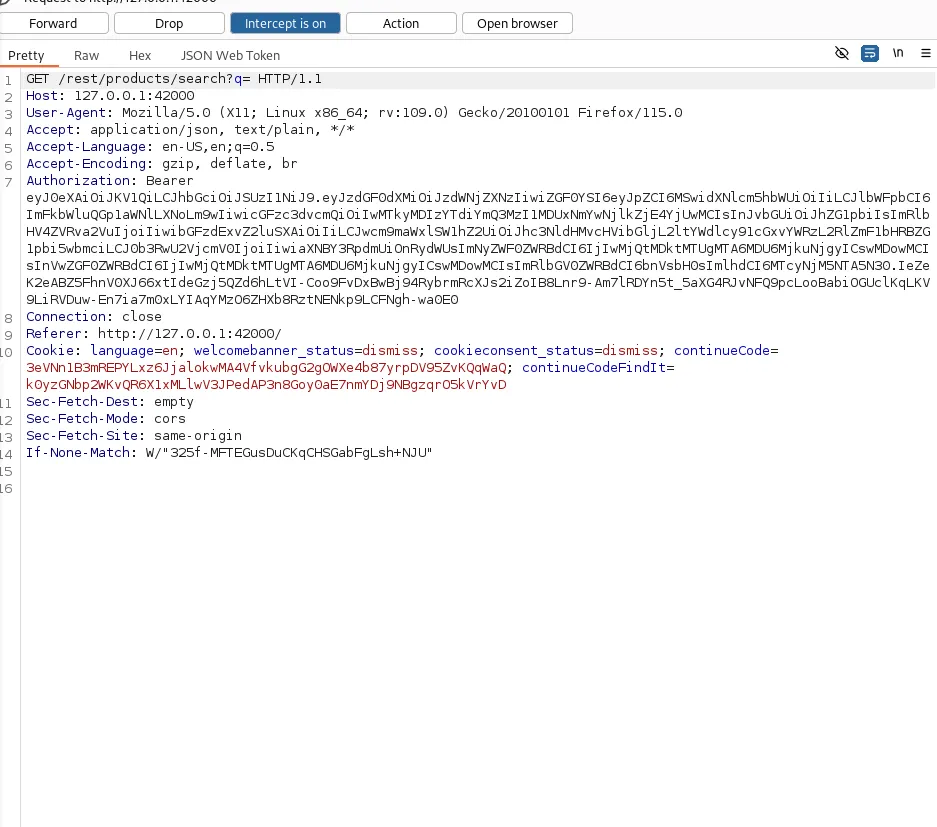
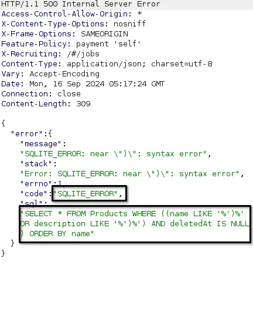
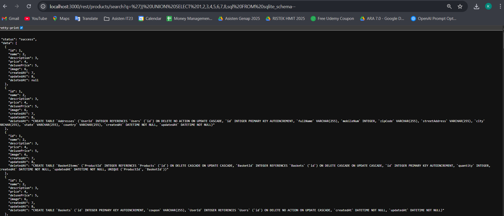

# Database Schema - OWASP JUICE SHOP

## Challenge Description

* **Category**: Injection
* **Difficulty**: ⭐⭐⭐
* **Description**: Exfiltrate the entire DB schema definition via SQL Injection.
* **Link Resource**: `http://localhost:3000/#/score-board?categories=Injection`

## Solution

### Step 1: Check search parameter

* We need to find an endpoint where the search parameter could get exposed so that we can craft an attack string against an endpoint that offers an unnecessary way to filter data.
* We can intercept traffic in burpsuite and look for the request related to the input field.
* We can find that the endpoint used is `/rest/products/search?q=`



### Step 2: Exposing the SQL Query and Database Engine

* To expose the queries and Database Engine we can send `')` payload
* This triggering the Internal Server Error and exposing the thing that we wanted.



We can extract the information that SQLite is the database engine and the sql queries
```sql
SELECT * FROM Products WHERE ((name LIKE '%' OR description LIKE '%') AND deletedAt IS NULL) ORDER BY name
```

### Step 3 : Queries

* We need to adjust our queries with the real sum of the column using `UNION SELECT`. We would know that the exact number is '9' so we can use the payload below

```
')) UNION SELECT 1,2,3,4,5,6,7,8,sql FROM sqlite_schema--
```

* By using the payload above, the content of `sqlite_schema` should be exposed

## Result

We are able to exfiltrate the entire DB schema.



## Explanation

The SQL Injection technique exploited here is a Union-based SQL Injection, specifically targeting the search parameter. The vulnerability arises from unsanitized user input being directly concatenated into SQL queries. By closing the original query and injecting a UNION SELECT, we were able to append our own query and extract the contents of the sqlite_schema table. This allowed us to retrieve the full database schema, including all table definitions and structures, demonstrating a severe information disclosure vulnerability.
