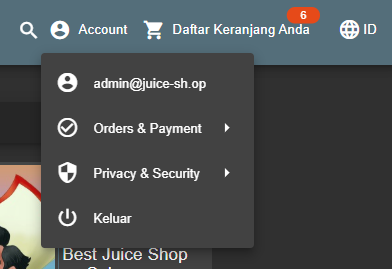

# Login Admin - OWASP JUICE SHOP

## Challenge Description

* **Category**: Injection
* **Difficulty**: ⭐⭐
* **Description**: Log in with the administrator’s user account.
* **Link Resource**: {this link}

## Solution

### Step 1: Check the DBMS Used

* To log in as the `admin` account, we will perform SQL Injection.
* First, go to the *login page* through the *`Account`* menu.
* As an initial step, we try to *trigger* an error using a common *payload* such as `'` in the email field and a random value for the password.
* From the response, we will gather information about which DBMS the server is using.


### Step 2: Exploitation

* We receive the message `[object Object]` and by checking the *Network* tab in DevTools, we discover that the DBMS being used is SQLite.
* To test for vulnerabilities, we can perform *Logic Testing* using an *always true condition*. For example, by entering the following commands in the email field while providing any value for the password:

```
' OR true--
```

or

```
' OR 1=1--
```


## Result

We are able to log in using the `Admin` credentials.



## Explanation

The SQL Injection (SQLi) concept used in this case is **Boolean-based SQL Injection**, exploiting **unsanitized input in the login form**. The vulnerability lies in the **lack of validation and parameterization in the SQL query**, allowing inputs like `' OR true--` or `' OR 1=1--` in the email field to manipulate the query logic into always being true (*always true condition*). As a result, authentication can be bypassed without a valid password, granting access to the administrator account.
