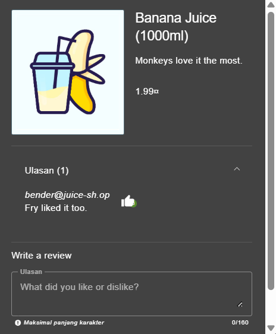
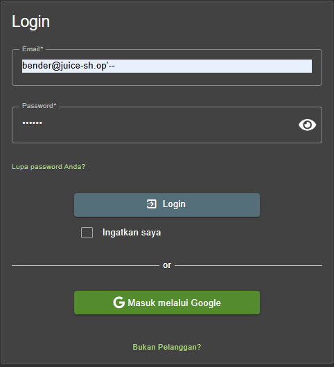
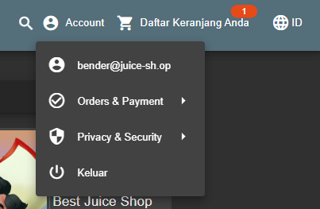

# Login Bender - OWASP JUICE SHOP

## Challenge Description

* **Category**: Injection
* **Difficulty**: ⭐⭐⭐
* **Description**: Log in with Bender's user account.
* **Link Resource**: `http://localhost:3000/#/score-board?categories=Injection`

## Solution

### Step 1: Searching Bender Account

* The first step that we'll do is doing some OSINT for Bender account at the webpage, we can find it in the review section of each product. And here I can found it in `Banana Juice (1000ml)` product.

### Step 2: Exploitation

*  After we found Bender account which is `Bender@juice-sh.op`, we'll use it as email in the Login form.
* We will try to do *Login Bypass* via Inline Comment. Same like the `Login Admin` challenge, we'll try to exploit the input sanitazion by adding this `'--` at the end of the email.

## Result

We are able to log in using `Bender` credential.

## Explanation

Since this challenge completely the same as `Login Jim`, the SQL Injection technique used here is **Login Bypass with Inline Comment**, a form of **Boolean-based SQL Injection**.