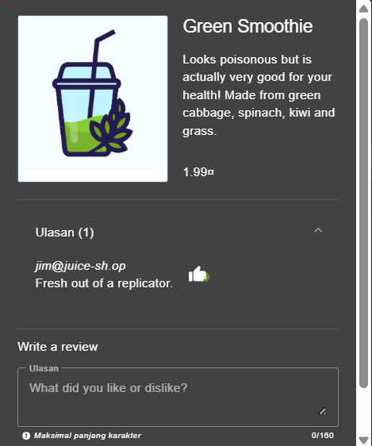
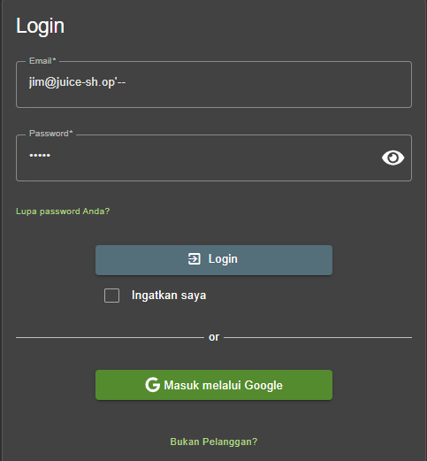
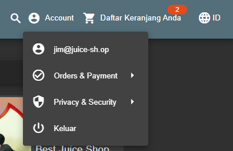

# Login Jim - OWASP JUICE SHOP

## Challenge Description

* **Category**: Injection
* **Difficulty**: ⭐⭐⭐
* **Description**: Log in with Jim's user account.
* **Link Resource**: `http://localhost:3000/#/score-board?categories=Injection`

## Solution

### Step 1: Searching Jim Account

* The first step that we'll do is doing some OSINT for Jim account at the webpage, we can find it in the review section of each product. And here I can found it in `Green Smoothie` product.

### Step 2: Exploitation

*  After we found Jim account which is `jim@juice-sh.op`, we'll use it as email in the Login form.
* We will try to do *Login Bypass* via Inline Comment. Same like the `Login Admin` challenge, we'll try to exploit the input sanitazion by adding this `'--` at the end of the email.

## Result

We are able to log in using `Jim` credential.

## Explanation

The SQL Injection technique used here is **Login Bypass with Inline Comment**, a form of **Boolean-based SQL Injection**. The vulnerability lies in the **unsanitized input on the login form**, which allows an attacker to prematurely close the email string and append `--` to comment out the rest of the SQL query, including the password validation. As a result, the query only checks whether the username `jim@juice-sh.op` exists in the database, and since it does, the system logs us in without requiring the correct password.
