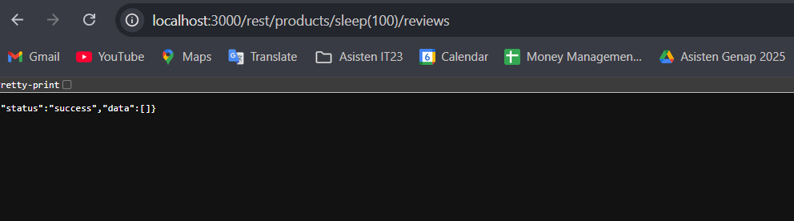

# NoSQL DoS - OWASP JUICE SHOP

## Challenge Description

* **Category**: Injection
* **Difficulty**: ⭐⭐⭐⭐
* **Description**: Let the server sleep for some time. (It has done more than enough hard work for you).
* **Link Resource**: `http://localhost:3000/#/score-board?categories=Injection`

## Solution

### Only Step

* To tackle this, we'll try to sleep the server so that it will not respond at some time. For the endpoint itself we will use `/rest/products/reviews`
The endpoint we use will be
`http://localhost:3000/rest/products/sleep(100)/reviews`

## Result

We are able to make the server sleep for some time.

## Explanation

The vulnerability exploited here is a form of **NoSQL Injection leading to Denial of Service (DoS)**. By sending a crafted request to the `/rest/products/reviews` endpoint with the function call `sleep(100)`, we force the database to pause execution for 100 seconds before returning a response. This type of injection demonstrates how unsanitized input is directly interpreted by the backend query engine, allowing attackers to manipulate execution flow. The impact is that the server’s resources are tied up unnecessarily, degrading performance or making the application temporarily unavailable for legitimate users.
