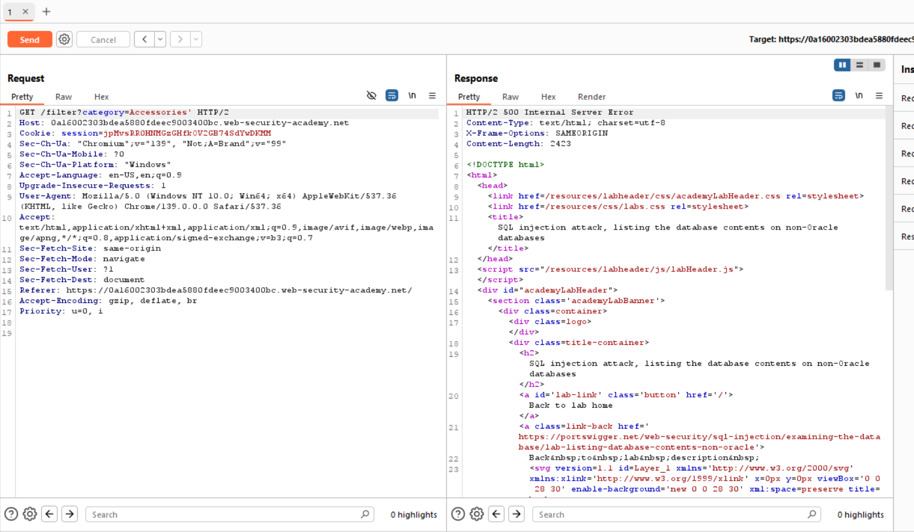
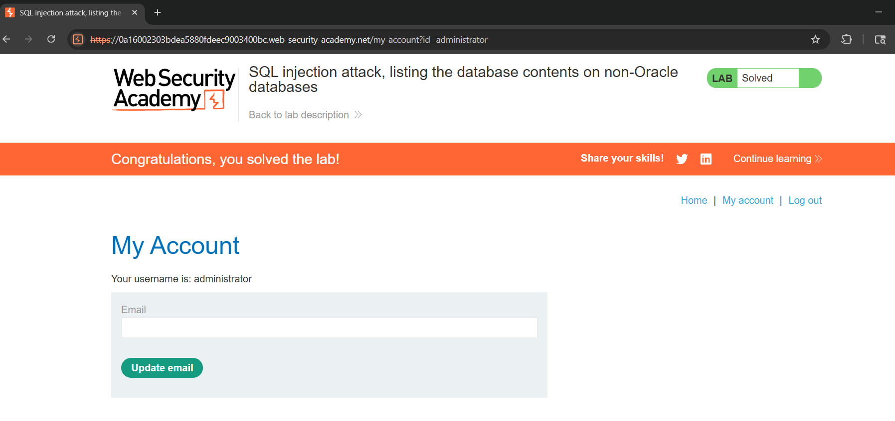

# SQL Injection Attack, Listing the Database Contents on Non-Oracle Databases - Portswigger Lab

## Challenge Description

* **Category**: SQL Injection
* **Description**: This lab contains a SQL injection vulnerability in the product category filter. The results from the query are returned in the application's response so you can use a UNION attack to retrieve data from other tables.

The application has a login function, and the database contains a table that holds usernames and passwords. You need to determine the name of this table and the columns it contains, then retrieve the contents of the table to obtain the username and password of all users.

To solve the lab, log in as the administrator user.
* **Link Resource**: `https://portswigger.net/web-security/sql-injection/examining-the-database/lab-listing-database-contents-non-oracle`

## Solution

### Step 1: Looking for SQL Injection vulnerability point

* When we start the lab, we are brought to a shopping page website. We will looking for the SQL injection point which they are presented at product category filters
* We can choose any filter, and then we will get into Burp.
* Get to the target tab and send the filtered request to the repeater.
* We will add a single quote `'` to the end of the filter and sending the request. This should be triggered a `500 Internal Server Error`




### Step 2 : Search for the exact number of columns and its data types

* In the repeater, we can try use this URL encoded payload '+ORDER+BY+1+--` so the filter will get like this

```
GET /filter?category=Pets'+ORDER+BY+1+-- HTTP/2
```

* To know exactly how many is the columns, we can change the `1` into the numbers that we wanted.
* If the request return `200 OK` then there is the define column, we will search a condition to make it response as `500 Internal Server Error`
* At the `3`, it return `500`, indicating that there are only 2 columns.
* We need to make sure is the data types are `text` by using the below payload

```
'+UNION+SELECT+'King','Europe'--
```

[datatype](../../assets/portswigger1-2.png)

* It is verified by the result that there are 2 columns and the data type is `text`

### Step 3 : Find the DB used by the system

* To verify the DB used, we can open the given [cheat sheet](https://portswigger.net/web-security/sql-injection/cheat-sheet) by PortSwigger.
* The challenge title shows that the DB is NOT AN ORACLE DB. So, we will try to check the other DB.
* Most likely, PostgreSQL is used by many site so we'll try the first shot there by using this payload

```
' UNION SELECT version(),'Europe'--
```

[dbversion](../../assets/portswigger1-3.png)

* The result showing `200` which mean it is a PostgreSQL Database.

### Step 4 : Find the table name in the Database

* Since we are facing a PostgreSQL DB, we will adjust our `UNION SELECT` queries, we'll not use `SELECT * (all)` and will specify the 2 columns we are looking for.
* Based on the given cheatsheet, we'll list the tables that exist in the database, and the columns that those tables contain by using the below payload

```
'+UNION+SELECT+table_name,'Europe'+FROM+information_schema.tables--
```

* The relevant table we're looking for will begin with `users_`

### Step 5 : Find the relevant column names in the table

* From the cheatsheet, we will use the second query for this DB

```
'+UNION+SELECT+column_name,'Europe'+FROM+information_schema.columns+WHERE+table_name+%3d+'users_ymwpjk'--
```

* The given payload will response with providing all the columns names in the table
* The column names we are looking for is begin with `username_` and `password_`.

### Step 6 : Find `Administrator` Creds

* We will insert the column names and table name in to a casual `SELECT`.

```
'+UNION+SELECT+username_rexymr,+password_gbsdjs+FROM+users_ymwpjk--
```

* The query will provide a list of all username and password found in the table, look for `administrator`

[administrator](../../assets/portsiwgger1-5.png)

### Step 7 : Login as `Administrator`

* Use the given credentials to login

## Result

We are able to log in as the administrator user



## Explanation

The vulnerability exploited in this lab is a **Union-based SQL Injection** in the product category filter. Because the application concatenates user input directly into SQL queries without sanitization or parameterization, we were able to inject payloads to determine the number of columns, confirm their data types, and identify the database engine as PostgreSQL. By unioning the target columns into the query, we extracted all user credentials, including the `administrator` account, and successfully logged in. This demonstrates a critical data exfiltration vulnerability that leads to full authentication bypass and complete compromise of the application.
